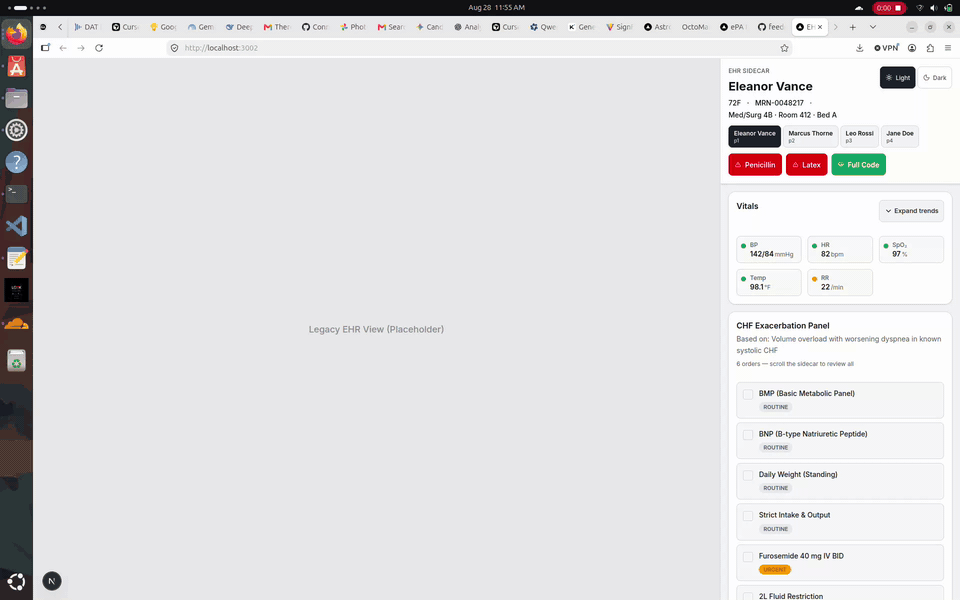
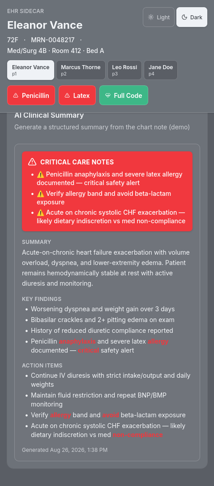
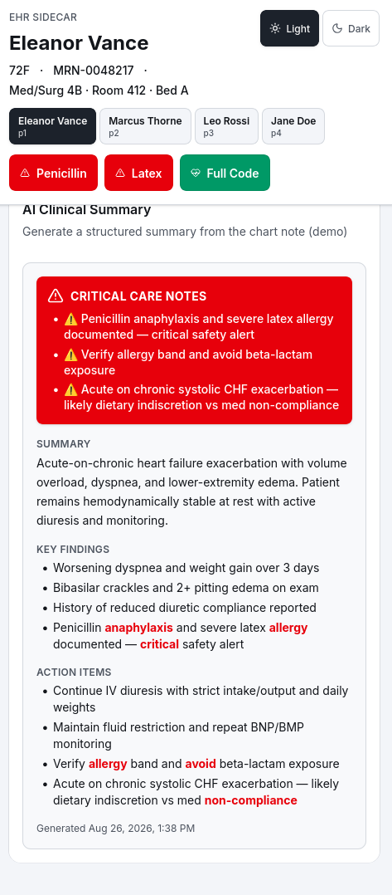
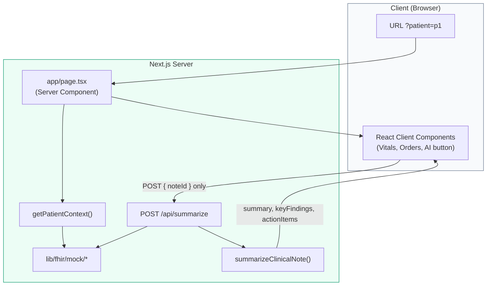

# EHR Sidecar & Quick-Action Panel

**A Clinical UX Demo for Reducing Click Fatigue in Legacy EHR Systems**


> **Demo:** [http://localhost:3000](http://localhost:3000) after `npm run dev`  
> **Note:** All patient data is synthetic mock FHIR — not for production PHI.

## Live Preview

Eleanor Vance (`/?patient=p1`) — sticky safety header, progressive vitals, CHF orders, then AI summary with **Critical Care Notes** (~12s GIF):



---

## 📸 Visual Walkthrough

Drop additional screenshots into `docs/screenshots/` using the filenames below (create any that are still missing). Paths are relative to the repo root.






| Filename | Suggested capture |
|----------|-------------------|
| `docs/screenshots/critical-care-banner.png` | p1 — AI summary with red **Critical Care Notes** banner (**included**) |
| `docs/screenshots/vitals-and-orders.png` | p1 — vitals row + CHF Exacerbation Panel |
| `docs/screenshots/sidecar-layout.png` | Desktop — legacy EHR placeholder + sidecar side-by-side |
| `docs/screenshots/ehr-sidecar-demo.png` | Earlier full-panel capture (optional archive) |

Verbal demo script: [`docs/walkthrough-script.md`](docs/walkthrough-script.md)

### Clinical walkthrough video (~42s)

Captioned MP4 (download): [ehr-sidecar-clinical-walkthrough.mp4](docs/demo/ehr-sidecar-clinical-walkthrough.mp4) · [demo notes](docs/demo/README.md)

```bash
npm run demo:walkthrough   # regenerate captioned MP4 (requires npm run dev)
```

---

## The Clinical Problem

Physicians using legacy EHR systems (Epic, Cerner, Meditech) spend **2+ hours per day** on administrative clicks — chart navigation, order entry, and documentation hunting. Research consistently links EHR burden to clinician burnout and reduced face-time with patients.

The core issue isn't missing data — it's **cognitive and click load**. Critical safety context (allergies, code status) and workflow actions (order sets, vitals trends) are buried behind multiple screens and modals.

---

## The Solution

We designed this sidecar concept to augment, not replace, legacy systems. This project demonstrates a focused clinical panel that lives beside the main chart and surfaces high-value workflow actions in **≤ 2 clicks**.

### Three Workflow Optimizations

| Optimization | What it does | Click budget |
|---|---|---|
| **Safety at a glance** | Allergies + code status in sticky header | 0 clicks |
| **Context-aware ordering** | Smart order sets matched to diagnosis/vitals | 1–2 clicks |
| **Progressive vitals review** | Latest vitals summary → expand for 48h trends | 1 click |

Our approach also elevates **AI safety triage**: when a note summary contains high-risk language (e.g. anaphylaxis, DNR, sepsis), a **Critical Care Notes** banner surfaces those alerts before the caregiver reads the full text.

---

## Architecture



**Key security pattern:** The client sends only a `noteId` to `/api/summarize`. The server looks up the raw clinical note, generates a summary, and returns **derived fields only**. Raw PHI never appears in client code or network payloads.

---

## Tech Stack

| Category | Technology | Purpose |
|----------|------------|---------|
| Framework | Next.js 16 (App Router) | Server Components, API Routes |
| Language | TypeScript | Strict typing, no `any` |
| Styling | Tailwind CSS v4 | Clinical semantic tokens, responsive design |
| UI Components | shadcn/ui | Accessible primitives (Button, Badge, Card, etc.) |
| State | URL Search Params | Shareable, stateless patient selection |
| Charts | Recharts (`dynamic`, `ssr: false`) | Vitals trend visualization |
| Validation | Zod | API input validation |
| Icons | lucide-react | Clinical iconography |

---

## Clinical UX Principles Applied

- **Semantic colors:** Red = critical/allergy · Yellow = warning · Green = normal/stable
- **44px touch targets** (`min-h-11`) for tablet bedside use
- **Progressive disclosure** — vitals and order sets collapsed by default
- **High contrast** for bright hospital environments
- **WCAG 2.1 AA** — icon + text labels (color never the sole indicator)
- **Keyboard navigation** — focus rings, `aria-expanded`, labeled controls
- **AI safety layer** — keyword scan elevates anaphylaxis / DNR / sepsis-class alerts

---

## Security & HIPAA-Minded Architecture

This is a **portfolio demo with synthetic data**, built using production-grade patterns.

We implemented a secure pattern where the browser never posts raw note text to the model layer:

| Rule | Implementation |
|------|----------------|
| No PHI on client | Server-only `getPatientContext()` aggregation |
| AI noteId pattern | Client POSTs `{ noteId }` → server lookup → summary only |
| No PHI logging | Zero `console.log` of patient data (verified) |
| Input validation | Zod schema on `/api/summarize` |
| Shareable state | Patient context via `?patient=ID` URL param (not localStorage) |
| Critical Care Notes | Client-side keyword elevation on **already-summarized** display fields only |

---

## Demo Script (60 seconds)

See the full verbal script: [`docs/walkthrough-script.md`](docs/walkthrough-script.md)

### Step 1 — Eleanor Vance (CHF)
Open **[/?patient=p1](http://localhost:3000/?patient=p1)**

1. **Header:** Red Penicillin + Latex allergy badges, green Full Code
2. **Vitals:** Latest BP/HR/SpO₂ with semantic status dots → click **Expand trends** for 48h Recharts
3. **Orders:** CHF Exacerbation Panel → select orders → **Add Selected Orders**
4. **AI:** Click **Generate AI Summary** → skeleton (~800ms) → **Critical Care Notes** banner + structured summary

### Step 2 — Marcus Thorne (Sepsis)
Open **[/?patient=p2](http://localhost:3000/?patient=p2)**

1. **Header:** Green NKDA badge, red DNR
2. **Vitals:** Expand trends — critical hypotension + tachycardia pattern
3. **Orders:** Sepsis Workup with STAT priorities
4. **AI:** ICU/sepsis-focused summary with critical keyword elevation

### Step 3 — Jane Doe (Minimal chart)
Open **[/?patient=p4](http://localhost:3000/?patient=p4)**

1. **Vitals:** Limited data points
2. **AI:** Empty state — "No clinical note available"
3. Demonstrates graceful degradation (no Critical Care Notes banner)

---

## Getting Started

```bash
# Install dependencies
npm install

# Run development server
npm run dev

# Open http://localhost:3000
```

### Build for production

```bash
npm run build
npm start
```

### Environment variables

Copy `.env.example` to `.env.local` for future integrations. **Not required for the demo.**

---

## Project Structure

```
app/
  page.tsx                 # Server Component — fetches PatientContext
  api/summarize/route.ts   # HIPAA-minded AI summarization endpoint
components/clinical/       # Domain components (header, vitals, orders, AI)
lib/fhir/
  types.ts                 # Strict FHIR-inspired TypeScript interfaces
  mock/                    # Synthetic patient data (server-safe)
  get-patient-context.ts   # Server-only aggregator
  summarize-note.ts        # Rule-based mock summarizer
lib/utils/
  extract-critical-alerts.ts  # Critical Care Notes keyword elevation
.cursor/rules/             # Persona rules (PM, UX, FE, Security)
docs/
  walkthrough-script.md    # 60-second interview / demo script
  screenshots/             # Visual walkthrough assets
  demo/                    # Inline GIF + captioned walkthrough MP4
```

---

## Future Roadmap

- [ ] Connect to real FHIR server (Epic Cosmos, Cerner Code)
- [ ] SMART on FHIR OAuth 2.0 authentication
- [ ] Production LLM integration with PHI redaction pipeline
- [ ] Real-time vitals via WebSocket / HL7 FHIR subscriptions
- [ ] Deploy to HIPAA-eligible infrastructure (AWS/Azure BAA)

---

## Screenshots

| Patient | URL | Scenario |
|---------|-----|----------|
| Eleanor Vance | `/?patient=p1` | CHF + severe allergies + order set + Critical Care Notes (**[see Visual Walkthrough](#-visual-walkthrough)**) |
| Marcus Thorne | `/?patient=p2` | Sepsis + DNR + critical vitals |
| Leo Rossi | `/?patient=p3` | Pediatric asthma + peanut allergy |
| Jane Doe | `/?patient=p4` | Minimal chart + empty states |

---

## License

MIT
